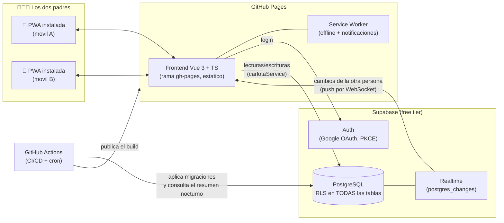
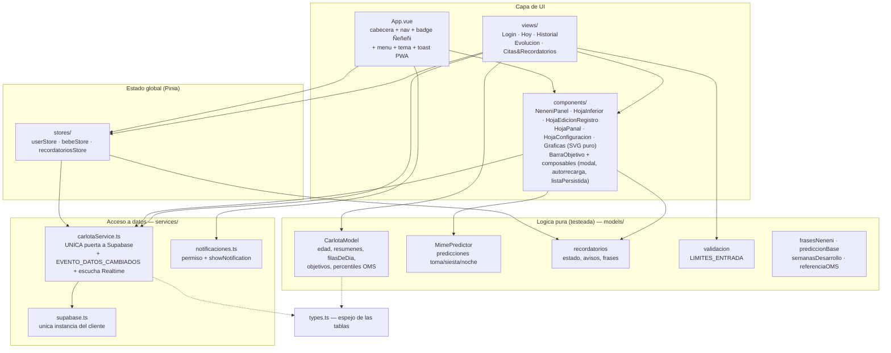
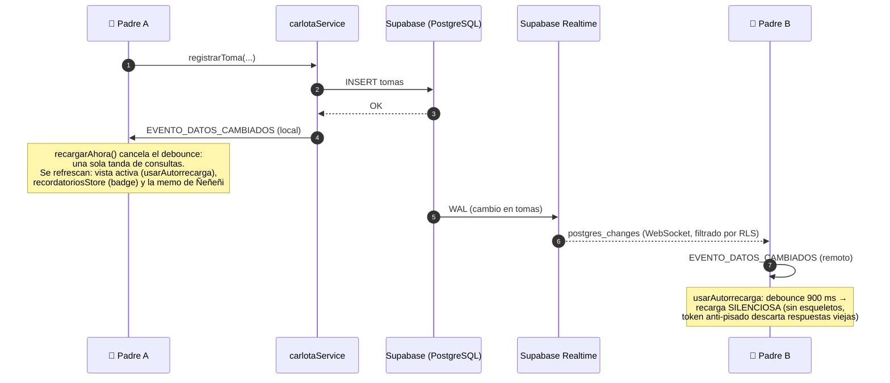
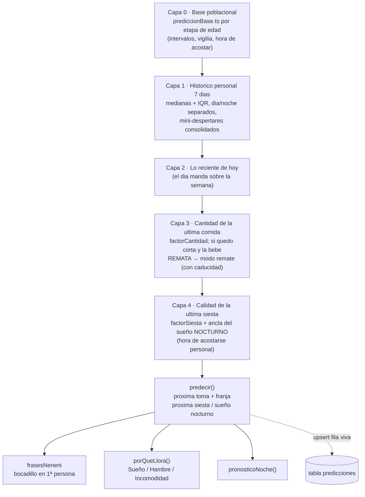
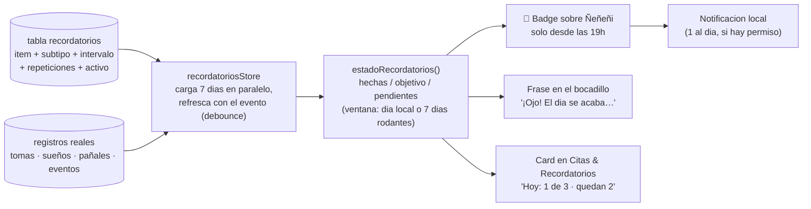
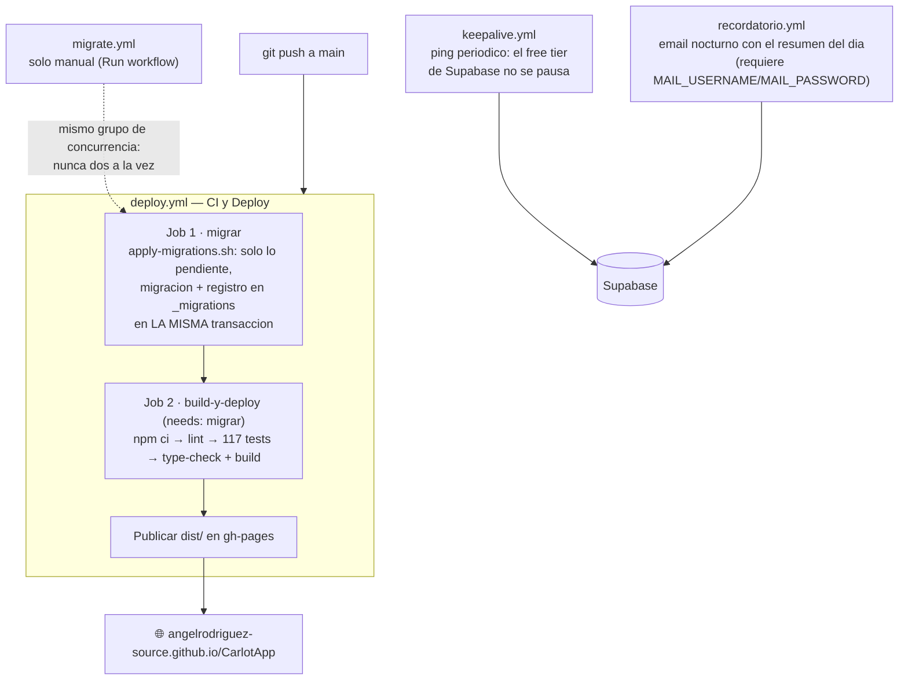

# 09 - Arquitectura en diagramas

Mapa visual COMPLETO de CarlotApp: como encajan las piezas, por donde
fluyen los datos y que hace cada modulo. Los diagramas son Mermaid
(GitHub los renderiza solo). Complementa a 01 (vision), 02 (base de
datos), 03 (frontend) y 07 (deployment) — aqui esta el "como se conecta
todo", alli el detalle de cada pieza.

## 1. Vista de pajaro

Dos padres, una PWA estatica servida por GitHub Pages, y Supabase como
unico backend (auth, datos, tiempo real). No hay servidor propio: toda
la logica vive en el navegador; la seguridad, en la base de datos (RLS).

La **lista blanca** es la unica puerta: `es_usuario_autorizado()`
comprueba el email contra `usuarios_autorizados` en cada operacion (RLS).
Un tercero con cuenta de Google puede loguearse, pero no ve ni una fila.

## 2. Capas del frontend

Regla de oro (se cumple en todo el codigo): **las vistas y componentes
JAMAS llaman a Supabase** — todo el acceso a datos pasa por
`services/carlotaService.ts`. Y la logica calculable vive en `models/`
como funciones puras (sin DOM, sin red): es lo unico testeado (Vitest,
117 tests).

- **`types.ts`** es transversal: los tipos de dominio (Toma, Sueno,
  Panal, Evento, Medida, Cita, Recordatorio, RegistroEditable) que
  reflejan las tablas.
- **`assets/branding.ts`** (no dibujado): URLs de todos los iconos
  (`ICONOS_REGISTRO`) y la mascota Ñeñeñi.
- Los modelos NO importan de components/ ni services/ — dependencia en
  un solo sentido.

## 3. El flujo estrella: registrar un dato y que TODO se entere

El corazon reactivo de la app es un unico evento de ventana,
`EVENTO_DATOS_CAMBIADOS`, que emite el servicio tras CUALQUIER
escritura — propia o recibida por Realtime. Todo lo que cachea datos lo
escucha. Sin polling.

Redes de seguridad: al volver la pestaña/PWA a **primer plano** se
recarga siempre (por si el socket durmio en segundo plano), y si la
suscripcion Realtime falla al entrar, se **reintenta a los 30 s**.

## 4. El Mime Predictor (Ñeñeñi) por capas

`predecir()` mezcla capas de conocimiento con *shrinkage* (cada capa
pesa segun cuantas muestras aporta, con constantes k calibradas por
backtest sobre bebes simulados). El resultado se cuenta en primera
persona en el bocadillo (frasesNeneni) y se persiste en la tabla
`predicciones` (una fila viva por bebe).

Todos los parametros (ventanas, k, umbrales, factores, caducidades)
viven en el objeto **`AJUSTES`** de MimePredictor.ts: un unico punto de
calibracion, cada valor con el comentario de POR QUE vale eso.

## 5. Recordatorios: estado calculado, nunca guardado

Un recordatorio es "este item deberia hacerse N veces por dia/semana".
Su estado NO se persiste: se cuenta contra los registros reales.

## 6. CI/CD: push = migrar + testear + publicar

El orden **migrar → publicar** garantiza que la UI nueva nunca llega
antes que su tabla. En PRs el job migrar se salta y solo corre la CI.

## 7. Modelo de datos

Todas las tablas con RLS por lista blanca; FKs a `bebes` con
`ON DELETE CASCADE`; todas llevan ademas `registrado_por` y `created_at`.

```mermaid
erDiagram
    BEBES ||--o{ TOMAS : tiene
    BEBES ||--o{ SUENOS : tiene
    BEBES ||--o{ PANALES : tiene
    BEBES ||--o{ EVENTOS : tiene
    BEBES ||--o{ MEDIDAS : tiene
    BEBES ||--o{ CITAS : tiene
    BEBES ||--o{ RECORDATORIOS : tiene
    BEBES ||--o| PREDICCIONES : "1 fila viva"

    BEBES { text nombre "Carlota" date fecha_nacimiento "2026-06-05" }
    TOMAS { timestamptz inicio "" timestamptz fin "null = en curso" text tipo "pecho izq/der · biberon formula/materna" int cantidad_ml "" }
    SUENOS { timestamptz inicio "" timestamptz fin "null = durmiendo" }
    PANALES { timestamptz fecha "" text tipo "pis/caca/mixto" text cantidad "poco/medio/mucho" }
    EVENTOS { timestamptz fecha "" text tipo "bano/vitamina_d/medicacion/unas/hito/otro/ejercicio" text subtipo "solo ejercicio" int duracion_min "solo ejercicio" }
    MEDIDAS { date fecha "" int peso_gramos "" numeric altura_cm "" numeric perimetro_craneal_cm "" text origen "casa/oficial" }
    CITAS { timestamptz fecha "" text titulo "" text tipo "medica/tramite/otro" bool completada "" }
    RECORDATORIOS { text item "toma…ejercicio" text intervalo "dia/semana" int repeticiones "1-24" bool activo "" }
    PREDICCIONES { timestamptz calculado_en "" timestamptz proxima_toma "" timestamptz proxima_siesta "" jsonb parametros "" }
    USUARIOS_AUTORIZADOS { text email "lista blanca (2 padres)" }
    MIGRATIONS { text name "control del runner" }
```

Ademas: `usuarios_autorizados` (la lista blanca que consulta
`es_usuario_autorizado()`) y `_migrations` (control del runner de
migraciones) — sin FK a bebes. Las 7 tablas de datos estan en la
publicacion `supabase_realtime` (autorrecarga).

## 8. Mapa de modulos (quien es quien)

| Modulo | Que hace | Depende de |
|---|---|---|
| `main.ts` | Arranque: Pinia, router, registro del SW, evento de version nueva | router, stores |
| `App.vue` | Layout raiz: cabecera (logo · Ñeñeñi+badge · usuario), nav, menu, tema, toast PWA, arranque de recordatorios y escucha Realtime, aviso de las 19h como notificacion | stores, service, notificaciones, modelos |
| `router/index.ts` | Hash router (Pages), guard de sesion, comodin → Hoy | userStore |
| **views/** | | |
| `LoginView` | Boton de Google | userStore |
| `HoyView` | Dashboard: card bebe, como va el dia (hitos+objetivos+registro), accesos, 6 hojas de alta | casi todo |
| `HistorialView` | Dias con resumen + filasDeDia + ritmo 24h + momentos | modelo, service |
| `EvolucionView` | Graficas OMS (valor/percentil), mediciones, sueño/tomas por dia | modelo, service |
| `CitasView` | Citas & Recordatorios: altas, estado, pausa | modelo, service, recordatoriosStore |
| **components/** | | |
| `NeneniPanel` | El bocadillo del predictor (modal, memo 60s) | MimePredictor, frasesNeneni, recordatorios |
| `HojaInferior` / `modal.ts` | Bottom sheet + ciclo de vida modal compartido | — |
| `HojaEdicionRegistro` | Editar/borrar cualquier registro (Hoy e Historial) | service, validacion |
| `HojaPanal` / `HojaConfiguracion` | Hojas extraidas de Hoy | service (via emits) |
| `Grafica*` / `BarraObjetivo` | SVG puro, sin librerias | modelo |
| `autorrecarga` / `listaPersistida` | Composables: recarga por evento+foreground / config por usuario | service / userStore |
| **models/** (testeados) | | |
| `CarlotaModel` | Edad, formatos, resumenes, filasDeDia, objetivos (TASA_LECHE_ML_KG), percentiles OMS, ritmo | types, referenciaOMS |
| `MimePredictor` | predecir/porQueLlora/pronosticoNoche (AJUSTES) | prediccionBase |
| `recordatorios` | estado/avisos/frases (AJUSTES_RECORDATORIOS) | CarlotaModel |
| `validacion` | Rangos de TODAS las entradas (LIMITES_ENTRADA) | — |
| `frasesNeneni` / `semanasDesarrollo` / `prediccionBase` / `referenciaOMS` | Voz de Ñeñeñi / etapas / linea base / OMS (generado) | — |
| **services/** | | |
| `carlotaService` | TODO el acceso a datos + evento global + escucha Realtime | supabase, types |
| `notificaciones` | Permiso + notificacion local via SW | branding |
| `supabase` | Unica instancia del cliente (PKCE) | — |
| **stores/** | | |
| `userStore` / `bebeStore` / `recordatoriosStore` | Sesion / bebe cacheado / estado de recordatorios | service |
